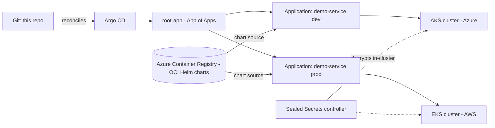

# Argo CD App of Apps — Multicloud GitOps Reference (Azure + AWS)

Sanitized reference architecture for GitOps delivery with **Argo CD** across two clouds, based on a pattern I designed and run in production for a large-scale platform (600+ repositories) deployed on **AKS (Azure)** and **EKS (AWS)** simultaneously for resilience.

## Architecture



Key decisions, and why:

1. **App of Apps** (`bootstrap/root-app.yaml`) — one root Application declares every child Application. Onboarding a new service is a PR adding one manifest under `apps/`; Argo CD reconciles the rest. No manual `argocd app create`.
2. **Helm charts as OCI artifacts in ACR** — charts are versioned, immutable artifacts in the same registry as images, pulled by Argo CD via `oci://`. No separate chart museum, and chart promotion follows the exact same governance as image promotion.
3. **Sealed Secrets instead of `helm --set` secrets** — plaintext `--set` values leak into CI logs, shell history, and Argo CD parameter views. SealedSecrets are encrypted *in Git*, auditable in PRs, and only the in-cluster controller can decrypt them. This repo replaced a `--set`-based model after a security review flagged critical exposure.
4. **Environment promotion via values files** — `environments/dev` and `environments/prod` hold per-environment values; promotion is a reviewed PR, never a manual sync with overrides.
5. **Active multicloud** — the same chart deploys to AKS and EKS with per-cluster destinations, giving cloud-level resilience with a single Git source of truth.

## Repository layout

```
bootstrap/     root Application (App of Apps entry point)
apps/          one Application manifest per service/environment
environments/  per-environment Helm values
secrets/       SealedSecret manifests (encrypted, safe in Git)
```

## Bootstrap

```bash
kubectl apply -n argocd -f bootstrap/root-app.yaml
# Everything else is reconciled from Git by Argo CD.
```

## Author

Alexander Abril — Senior DevOps Engineer / Platform Engineer
[linkedin.com/in/abrilalexander](https://www.linkedin.com/in/abrilalexander) · [github.com/devraam](https://github.com/devraam)
